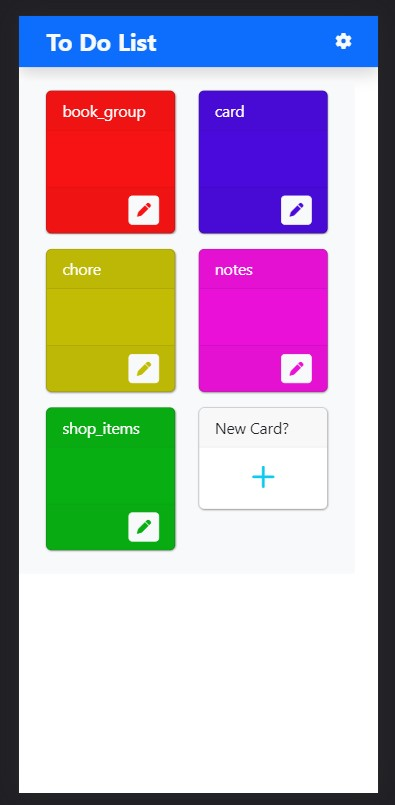
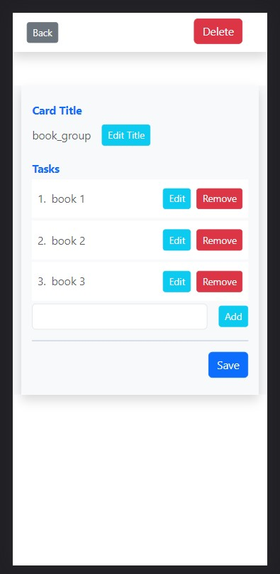

# To Do List Project

`simple and easy`

- Languages : `html`, `css`, `js`, `php`, `mysql`
- Framework: `bootstrap`
- Icons: `fontawesome`


  We can create **Note Cards**! Easy and sample way to do it. Currently, Login and Setting ain't available right now. Trying to make it better much more than ever before.
___
- ScreenShots
  
  

``` Wanna See more Project ``` =>
[Project](https://github.com/Hein-HtetSan?tab=repositories)

Thanks for paying attention to my repo!
